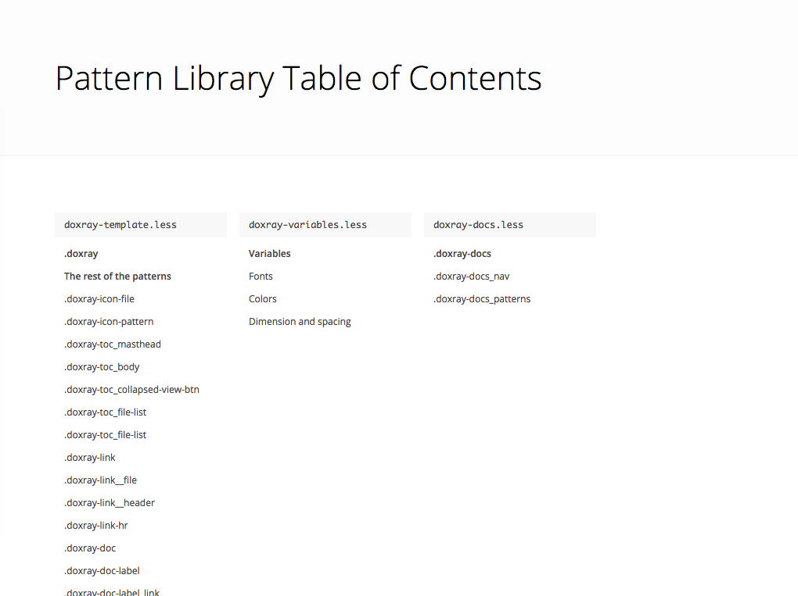
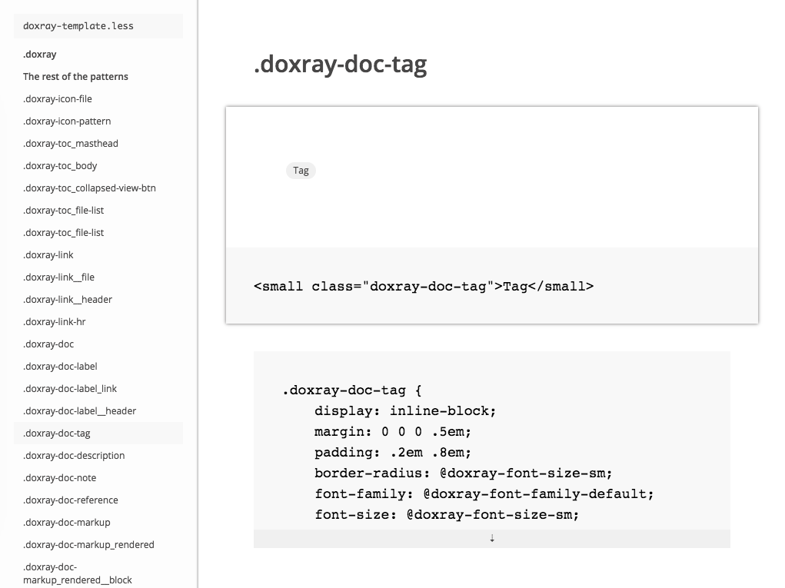

# Doxray-template

A handlebars.js template for Doxray

[Demo](http://himedlooff.github.io/doxray-template/docs/)

Table of contents screencap



Example pattern screencap



## Getting started

- Set up a folder for the template files to live in. You can name it anything
  you want but as an example let's call it `docs`.
- Download the template files from the `template` folder of this repository. I
  recommend using <http://bower.io/> so you can easily update the template if
  you need to.
- After downloading, move all of the files in the `template` folder into `docs`.
  I recommend using a task runner like <http://gruntjs.com/> or
  <http://gulpjs.com/> so you can easily move the template files after
  downloading them.
- Set up Doxray to write a file named `doxray-parsed-data.js` into `docs`. You
  can do this from the command line or by setting up a Grunt or Gulp task.
- That's it, open the `index.html` file in `docs`.

## An example using Bower and Gulp

```bash
# Download the template files
$ bower install doxray-template
```

```js
// Move the template files into `docs`.
// You only need to do this after installing or updating doxray-template.
gulp.task('move-doxray-template', function() {
    return gulp.src(['bower_components/doxray-template/template/*'])
    .pipe(gulp.dest('docs'));
});

// Parse the files you want to generate documentation from.
// Saved the parsed data as `doxray-parsed-data.js` into the same folder you
// placed the template files.
gulp.task('doxray', function() {
    doxray(['my-file.less'], { jsFile: 'docs/doxray-parsed-data.js' });
});
```

## Getting involved

Feedback and contributions are welcome.
Please read [CONTRIBUTING](CONTRIBUTING.md).

To file a bug please us this handy [template](https://github.com/himedlooff/doxray-template/issues/new?body=%23%23%20URL%0D%0D%0D%23%23%20Actual%20Behavior%0D%0D%0D%23%23%20Expected%20Behavior%0D%0D%0D%23%23%20Steps%20to%20Reproduce%0D%0D%0D%23%23%20Screenshot&labels=bug).
